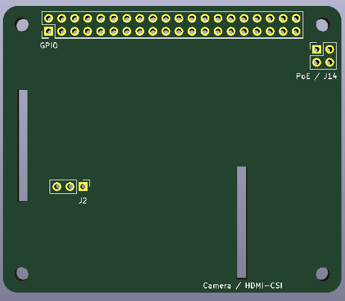
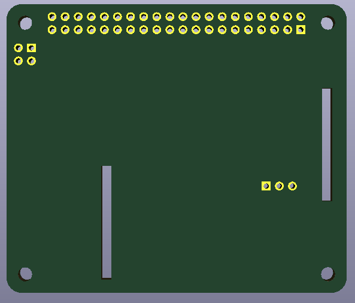

# Raspberry Pi 4 Hat template
A template to build your own Raspberry Pi 4 Hat with KiCAD. It already has all the settings set to get your hat produced by [JLCPCB](https://jlcpcb.com/). It utlizes the 4 mounting holes of the Raspberry. The idea is to have GPIO stacking headers such as [these](https://www.adafruit.com/product/2223) protude the hat so you still have access to GPIO and PoE and mount other hats on top if you have / want to. Only tested with Raspberry Pi 4 so far but should fit older Raspberry models as well.

# Renders
## Front

## Back

# Thanks
This project is based on https://github.com/sethhillbrand/kicad_templates/JLCPCB_1-2Layer.
